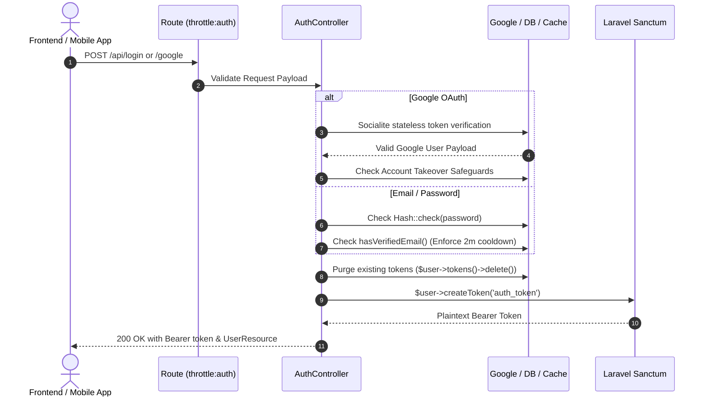

# Auth Module Documentation

Welcome to the **Auth Module** for **Lamsa.ma**. This document provides an architectural and technical reference for developers maintaining or extending authentication, identity management, and authorization roles.

---

## 1. Architectural Strategy & Auth Type

* **Type**: **Stateless REST API Authentication** using **Laravel Sanctum** (Personal Access Tokens).
* **Guards**: `api` routes authenticate via Sanctum (`auth:sanctum` middleware) expecting a `Bearer <token>` in the HTTP `Authorization` header.
* **Token Policy**:
  * **Single Active Session per Login**: During `login()` and `googleLogin()`, `$user->tokens()->delete()` is invoked before creating a new token. This ensures a clean slate and invalidates lingering sessions.
  * **Configurable Lifetime**: Token lifetime defaults to `config('sanctum.expiration')` (defaulting to 10,080 minutes / 7 days).
* **Role System**: Powered by `spatie/laravel-permission`. Every newly registered user is assigned either `buyer` or `artisan`.

---

## 2. Dependencies & Third-Party Packages

| Package | Purpose in this Module |
| :--- | :--- |
| `laravel/sanctum` | Issues, validates, and revokes plaintext API tokens stored hashed in the `personal_access_tokens` database table. |
| `laravel/socialite` | Facilitates Google OAuth verification. Rather than doing the standard server-side OAuth redirect loop, it statelessly validates the Google ID token received from the frontend (`Socialite::driver('google')->stateless()->userFromToken($token)`). |
| `spatie/laravel-permission` | Provides the `HasRoles` trait on the `User` model (`assignRole()`, `hasRole()`), segregating permissions for `buyer`, `artisan`, and `admin`. |

---

## 3. Environment & Configuration Requirements

Ensure the following environment keys are defined in `.env`:

```dotenv
# Sanctum Token Lifetime (in minutes)
SANCTUM_EXPIRATION=10080

# Google OAuth (configured in config/services.php)
GOOGLE_CLIENT_ID=your-google-client-id.apps.googleusercontent.com
GOOGLE_CLIENT_SECRET=your-google-client-secret
GOOGLE_REDIRECT_URI="${APP_URL}/api/auth/google/callback"

# Mail (Required for queued email verification)
MAIL_MAILER=smtp
MAIL_HOST=...
MAIL_PORT=...
MAIL_USERNAME=...
MAIL_PASSWORD=...
MAIL_FROM_ADDRESS="no-reply@lamsa.ma"
MAIL_FROM_NAME="Lamsa"
```

---

## 4. Feature & Route Map

All routes are registered under `Modules/Auth/routes/api.php`.

### Public Endpoints (Throttled via `throttle:auth`)

| Method | Endpoint | Form Request | Purpose / Mechanics |
| :--- | :--- | :--- | :--- |
| `POST` | `/register` | `RegisterRequest` | Creates a `User`. If `role === 'artisan'`, also creates an `Artisan` profile (`status: pending`). Dispatches `UserRegistered` and sends a verification email. |
| `POST` | `/login` | `LoginRequest` | Verifies credentials with `Hash::check()`. Blocks unverified users (HTTP 403). Purges old tokens and returns a new Bearer token. |
| `POST` | `/google` | `GoogleLoginRequest` | Accepts `{ id_token }` from frontend Google One-Tap/Sign-In. Verifies token via Socialite. Auto-provisions user as `buyer` with `email_verified_at = now()`. |

### Signed Public Endpoints

| Method | Endpoint | Middleware | Purpose / Mechanics |
| :--- | :--- | :--- | :--- |
| `GET` | `/email/verify/{id}/{hash}` | `signed` | Validates cryptographic signature and SHA-1 hash of the user's email. Calls `$user->markEmailAsVerified()`. |

### Protected Endpoints (`auth:sanctum`)

| Method | Endpoint | Form Request | Purpose / Mechanics |
| :--- | :--- | :--- | :--- |
| `GET` | `/me` | None | Returns the current user with roles and artisan relationship loaded. |
| `PUT` | `/profile` | `UpdateProfileRequest` | Updates user details (and artisan bio/region if role is artisan). |
| `PUT` | `/password` | `UpdatePasswordRequest` | Updates user password (`Hash::make`). |
| `POST` | `/logout` | None | Revokes **current** device access token (`$request->user()->currentAccessToken()->delete()`). |
| `POST` | `/logout-all` | None | Revokes **all** active tokens for user across all devices (`$request->user()->tokens()->delete()`). |

---

## 5. Key Security Invariants & Mechanics

### A. Account Takeover Prevention (Google OAuth)
When authenticating via Google:
1. If the email exists in the database with `provider_name !== 'google'` (e.g., registered via email & password), the request is rejected with **`409 Conflict`**. This prevents an attacker who controls a Google account with that email from hijacking an existing password account.
2. If `provider_id !== $googleUser->getId()`, it is rejected with **`403 Forbidden`** to ensure provider ID consistency.

### B. Email Verification Cooldown Lock
When an unverified user attempts to log in:
- The system returns HTTP `403`.
- Instead of spamming emails on every failed login, it checks `Cache::has('resend_cooldown:' . $user->id)`.
- If absent, it sends a fresh verification email and sets a **2-minute cache lock**. This prevents inbox flooding and mail service blacklisting.

### C. Signed Email Verification URLs
Verification links use Laravel's `URL::temporarySignedRoute()`. The URL contains:
- `id`: User ID.
- `hash`: `sha1($user->getEmailForVerification())`.
- `signature`: HMAC SHA-256 hash using `APP_KEY`.
The `signed` middleware guarantees the URL cannot be tampered with (e.g. changing the user ID).

---

## 6. Request Lifecycle Flow



---

## 7. How to Extend

1. **Adding Another Social Provider (e.g., Apple, Facebook)**:
   - Add credentials in `config/services.php`.
   - Add provider validation in `AuthController`: verify token via `Socialite::driver($provider)->stateless()->userFromToken($token)`.
   - Enforce the same account takeover checks (`provider_name` matching).
2. **Handling Artisan Onboarding Approval**:
   - Newly created artisans have `status = 'pending'`.
   - To activate an artisan, an admin endpoint should update the `Artisan` model's status to `'active'`.
